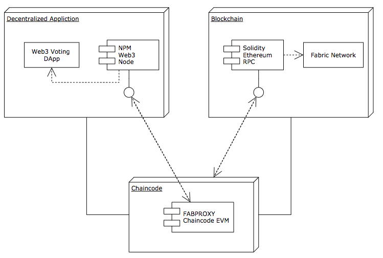
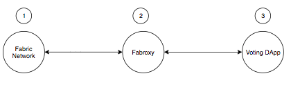
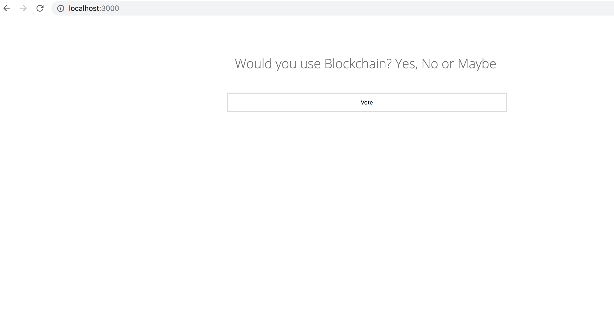
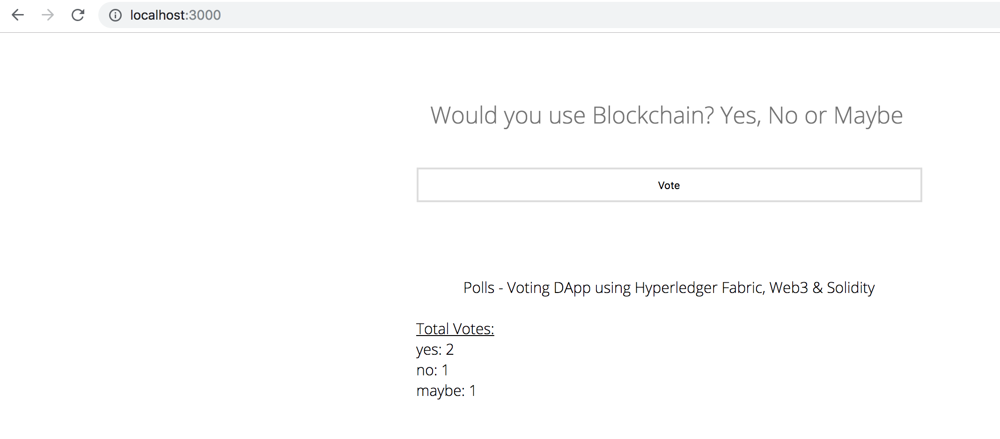

## Blockchain DApp - {Web3, Ethereum, Solidity, Hyperledger Fabric, Chaincode EVM}

Simple Web3 Hyperledger Fabric - Hyperledger [Burrow EVM](https://github.com/hyperledger/burrow) Voting Decentralized Application

With few clicks, run smart contracts from Solidity onto Ethereum Virtual Machine (EVM) that is embedded into Hyperledger Fabric to compiles these contracts as bytecode, of course, with the help of the chaincode.

* The following architecture puts together an understanding of the component blocks that are making the application work:



<hr>

## Before we start

Make sure to have the following prerequisite tools are installed on your machine: [NPM](https://www.npmjs.com/), [Node](https://nodejs.org/en/), [Go](https://golang.org/dl/), [Docker](https://www.docker.com/).

These scripts in this project have been tried and are macOS compatible but if there are machine issues, then follow the steps [here](https://github.com/hyperledger/fabric-chaincode-evm/blob/master/examples/EVM_Smart_Contracts.md) to bring up __manually__ the needed containers, peers and fabproxy up and running.

<u>_Note:_</u> Take into consideration that running `./start/sh` will remove existing docker containers and images. If there are no containers or images on your machine, you can comment out the docker `stop`, `rm` and `rmi` in `start.sh`.

If you would like to see the steps of everything happening behind the scenes, check [here](ingredients.md).


## STEPS



<hr>

__Read carefully the steps of this tutorial to build a successful setup:__

* <b>STEP 1 - `./start.sh` - run this script file</b>

* <b>STEP 2 - copy/paste the following sections in the same terminal:</b>

```bash
1) # COPY/PASTE THIS SECTION IN THE TERMINAL

export CORE_PEER_MSPCONFIGPATH=/opt/gopath/src/github.com/hyperledger/fabric/peer/crypto/peerOrganizations/org1.example.com/users/Admin@org1.example.com/msp
export CORE_PEER_ADDRESS=peer0.org1.example.com:7051
export CORE_PEER_LOCALMSPID="Org1MSP"
export CORE_PEER_TLS_ROOTCERT_FILE=/opt/gopath/src/github.com/hyperledger/fabric/peer/crypto/peerOrganizations/org1.example.com/peers/peer0.org1.example.com/tls/ca.crt


2) # COPY/PASTE THIS SECTION IN THE TERMINAL

peer chaincode install -n evmcc -l golang -v 0 -p github.com/hyperledger/fabric-chaincode-evm/evmcc
peer chaincode instantiate -n evmcc -v 0 -C mychannel -c '{"Args":[]}' -o orderer.example.com:7050 --tls --cafile /opt/gopath/src/github.com/hyperledger/fabric/peer/crypto/ordererOrganizations/example.com/orderers/orderer.example.com/msp/tlscacerts/tlsca.example.com-cert.pem


3) # RUN this script file in a NEW separate terminal

./proxy.sh

# The fab proxy will be available at `localhost:5000`.
```

* <b>STEP 3 - In a separate terminal, go back to the project's folder and run the web app locally by doing:</b>

```javascript
1) npm install
2) npm start
```

Open your browser at [localhost:3000](http://localhost:3000) to view the app.

<hr>



<hr>



<hr>

## References

* [Hyperledger Fabric v1.3](https://github.com/hyperledger/fabric-samples)
* [Hyperledger Fabric Chaincode EVM](https://github.com/hyperledger/fabric-chaincode-evm)
* [Solidity](https://solidity.readthedocs.io/en/v0.4.25/index.html)
* [Web3](https://web3js.readthedocs.io/en/1.0/)
* [Ethereum JSON RPC API](https://github.com/ethereum/wiki/wiki/JSON-RPC)

## License
[Apache 2.0](LICENSE)
