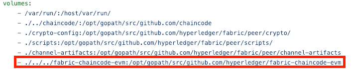

###### stop/delete previously running docker containers/images
```bash
docker stop $(docker ps -q)
docker rm $(docker ps -aq)
docker rmi $(docker images -q) -f
```

###### clone fabric samples version 1.3
```bash
git clone https://github.com/hyperledger/fabric-samples.git
```

###### clone the voting repo
```bash
git clone https://github.com/hovig/web3-fabric-voting-dapp.git
cd fabric-samples
git checkout release-1.3
```

###### install/run the latest docker images for Hyperledger Fabric
```bash
./scripts/bootstrap.sh
```

###### clone fabric chaincode evm
```bash
cd $HOME/go/src/github.com/hyperledger/
git clone https://github.com/hyperledger/fabric-chaincode-evm.git

cd $HOME/go/src/github.com/hyperledger/fabric-samples/first-network
```

###### copy/paste under `volumes:` in `docker-compose-cli.yaml` to include the following line:

`- ./../../fabric-chaincode-evm:/opt/gopath/src/github.com/hyperledger/fabric-chaincode-evm`

<hr>



<hr>

###### fabric network execution
```bash
./byfn.sh -m down
./byfn.sh -m up
docker exec -it cli bash

export CORE_PEER_MSPCONFIGPATH=/opt/gopath/src/github.com/hyperledger/fabric/peer/crypto/peerOrganizations/org1.example.com/users/Admin@org1.example.com/msp
export CORE_PEER_ADDRESS=peer0.org1.example.com:7051
export CORE_PEER_LOCALMSPID="Org1MSP"
export CORE_PEER_TLS_ROOTCERT_FILE=/opt/gopath/src/github.com/hyperledger/fabric/peer/crypto/peerOrganizations/org1.example.com/peers/peer0.org1.example.com/tls/ca.crt

peer chaincode install -n evmcc -l golang -v 0 -p github.com/hyperledger/fabric-chaincode-evm/evmcc
peer chaincode instantiate -n evmcc -v 0 -C mychannel -c '{"Args":[]}' -o orderer.example.com:7050 --tls --cafile /opt/gopath/src/github.com/hyperledger/fabric/peer/crypto/ordererOrganizations/example.com/orderers/orderer.example.com/msp/tlscacerts/tlsca.example.com-cert.pem
```

#### in a NEW separate terminal
###### export fabric proxy settings
```bash
export FABPROXY_CONFIG=$HOME/go/src/github.com/hyperledger/fabric-chaincode-evm/examples/first-network-sdk-config.yaml
export FABPROXY_USER=User1
export FABPROXY_ORG=Org1
export FABPROXY_CHANNEL=mychannel
export FABPROXY_CCID=evmcc
export PORT=5000
```

###### build & start
```bash
cd $HOME/go/src/github.com/hyperledger/fabric-chaincode-evm
go build -o fab3 ./fabproxy/cmd
./fab3
```

###### in a separate terminal, go back to the project's folder and run the web app locally
```javascript
npm install & npm start
```

###### The fab3 proxy will be available in a browser at `http://localhost:5000`
